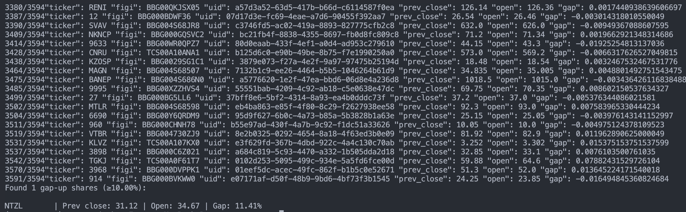

Обновлённая версия с инструкциями по использованию **uv** для установки и запуска:

# Gap Scanner – сканер утренних ценовых гэпов

**Gap Scanner** – это модуль Python для поиска акций, которые открылись с утренним гэпом вверх (разницей между ценой открытия и предыдущим закрытием) не менее заданного порога (по умолчанию ≥10%). Сканер предназначен для работы с российскими акциями через API Tinkoff Invest.

---

## 🚀 Установка и запуск

### 1. Установка Python

- Убедитесь, что у вас установлен **Python 3.10** или выше.
- Установите менеджер пакетов **uv**, если он ещё не установлен:

```bash
pip install uv
```

### 2. Получение API-токена

* Получите API-токен от [Tinkoff Invest](https://tinkoff.github.io/investAPI/token/).
* Скопируете .env.example в .env:
* Задайте токен в .env:

```dotenv
TINKOFF_INVEST_TOKEN=ваш-токен
```

### 3. Установка зависимостей через uv

Используйте команду для установки всех зависимостей с помощью **uv**:

```bash
uv sync
```

### 4. Запуск сканера через uv

Запуск модуля с параметрами по умолчанию (дата – сегодня, гэп ≥10%):

```bash
uv run gap_scanner.py
```

Или напрямую указав путь к модулю:

```bash
uv run src/gap_scanner/gap_scanner.py
```

---

## 📌 Примеры использования

### Пример 1. Сканирование текущей даты (сегодня):

```bash
uv run gap_scanner
```

Результат – список акций, которые открылись сегодня с гэпом от 10% и выше. 



Если подходящих акций нет, будет выведено:

```
No gappers found.
```


### Пример 2. Указание даты и порога гэпа:

Сканирование за конкретную дату (например, 18 июля 2025 г.) с порогом гэпа 12%:

```bash
uv run gap_scanner --date 2025-07-18 --gap 0.12
```

* `--date` – дата в формате YYYY-MM-DD
* `--gap` – минимальный гэп (дробное значение, 0.12 = 12%)

Результатом будет список акций с указанием тикера, цены предыдущего закрытия, цены открытия и величины гэпа.